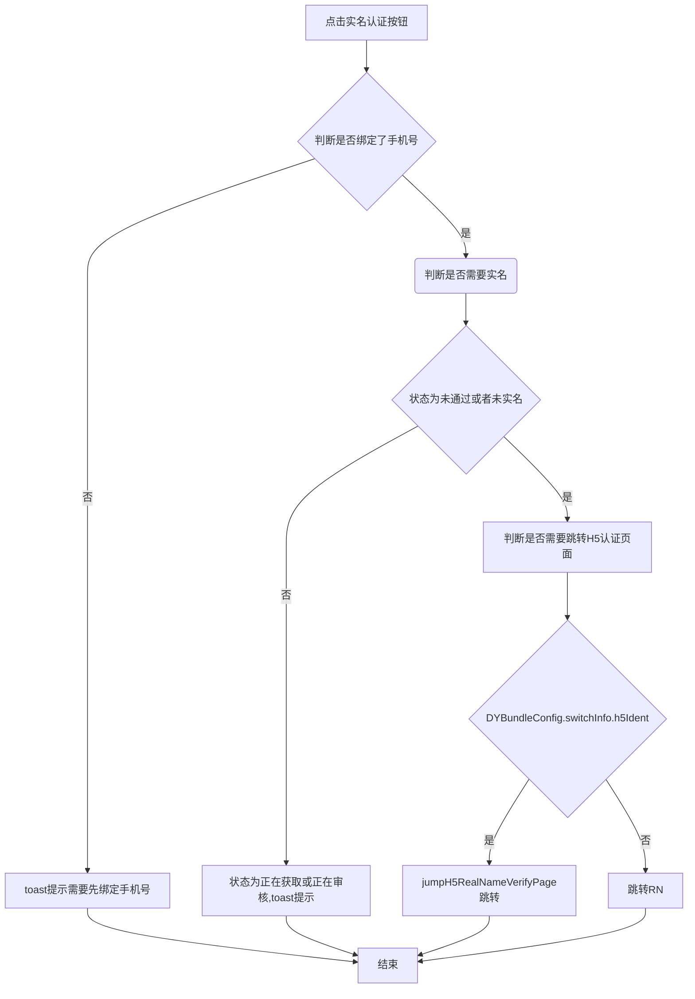
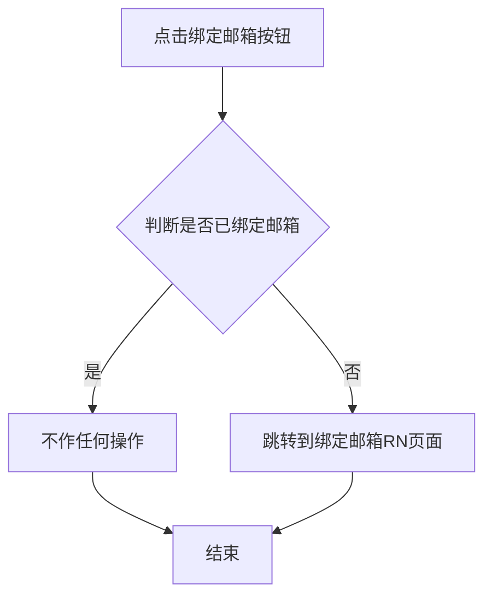

### 斗鱼app个人中心整体优化桥接文档（RN）

&ensp;

#### 跳转实名认证逻辑

#### 跳转绑定邮箱逻辑

**原生Android和iOS通过‘模块名’+‘组件名’方式跳转对应RN页面**

|页面名称 | 个人资料-实名认证 | 个人资料-绑定邮箱|
|:---:|:---:|:---:|
|模块名（module） | DYRNPersonalCenter | DYRNPersonalCenter|
|组件名（component）| RealNameVerify | BindEmail|
|参数| 无 | 无|
